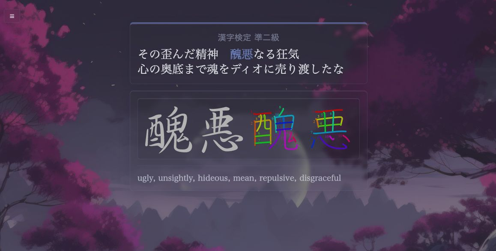
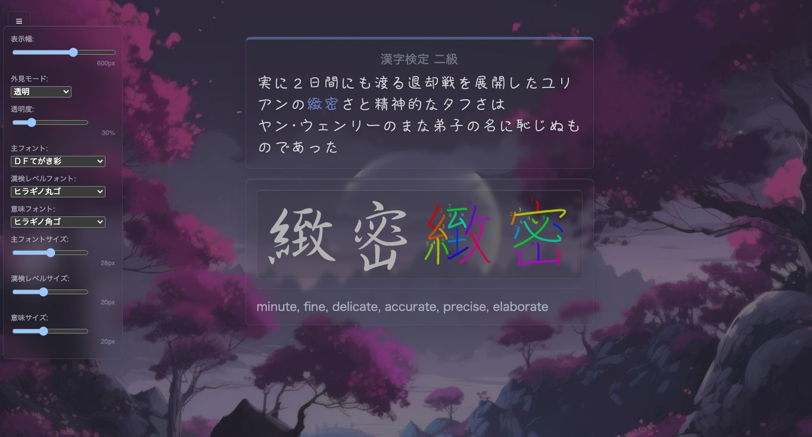
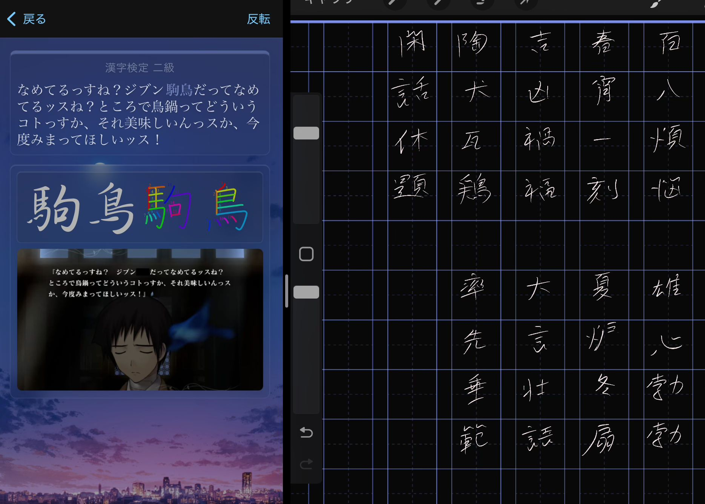

# Kanken Writing Deck (10級-2級)

A complete redesign of Qm's popular Kanken deck, covering all Jouyou kanji from 10級 to 2級. Features modern styling, customizable themes, and gyousho reference images.

## Features

- **Modern Card Design**: Clean, responsive layout with mobile-friendly narrow mode
- **Dual Theme Options**: Choose between default or transparent mode
- **Writing References**: Includes both stroke order diagrams and gyousho (行書) reference images
- **Customizable Interface**: Adjustable fonts, sizes, transparency, and card width
- **Responsive Design**: Optimized for desktop, tablet, and mobile devices
- **Complete Coverage**: All Jouyou kanji from elementary to high school levels

## Screenshots

### Front Card

### Back Card  

### Settings Panel

### Narrow Mode (iPad/Mobile)

## Installation

1. Download the template from [Releases](https://github.com/kiwakiwaa/kanken-anki-template/releases)
2. Import into Anki
3. Optionally download the complete deck with all cards

## Credits

Based on the [original Kanken deck](https://ankiweb.net/shared/info/759825185) by Qm. Enhanced with modern design and additional learning materials.

---

# 漢検練習デッキ（10級-2級）

Qmさんの人気漢検デッキを完全リデザインし、JSからJKレベルまでの常用漢字をカバーした書字練習用デッキです。

## 特徴

- **モダンなカード設計**: スマートフォン・タブレット対応のレスポンシブデザイン
- **2つのテーマ**: デフォルトモードと美しい透明モードから選択可能
- **充実した書字参考資料**: 筆順図に加え、行書体の参考画像を追加
- **カスタマイズ可能**: フォント、サイズ、透明度、カード幅を自由に調整
- **レスポンシブ対応**: デスクトップ、タブレット、スマートフォンに最適化
- **完全網羅**: 小学校から高校レベルまでの常用漢字をすべて収録

## インストール

1. [リリース](https://github.com/kiwakiwaa/kanken-anki-template/releases)からテンプレートをダウンロード
2. Ankiにインポート
3. 必要に応じて完全版デッキもダウンロード可能

## 使い方

- 筆順図を参考に漢字の書字練習
- 行書体を参考に自然な手書きの流れを学習
- 設定メニュー（☰）で外見をカスタマイズ
- 学習環境に応じてテーマを切り替え

## クレジット

Qmさんの[オリジナル漢検デッキ](https://ankiweb.net/shared/info/759825185)をベースに、モダンなデザインと追加学習素材で強化しました。